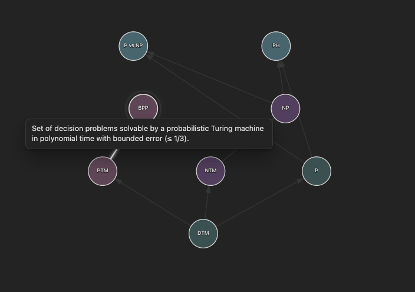

# Roadmap Graph

Roadmap Graph is an Obsidian plugin that visualizes note dependencies as an interactive directed acyclic graph (DAG).  
Each roadmap is defined by a dedicated configuration note, enabling multiple independent maps in a single vault.



---

## Features

- Multiple roadmaps via configuration notes (`roadmap_config: true`).
- Hierarchical layout by dependency level (sources lower, dependents higher).
- Deterministic layout using a configuration **seed**; **Shuffle** regenerates seed and layout.
- Zoom & pan (mouse wheel to zoom; drag background to pan).
- Visual editing: add and remove edges between notes in-place.
- Node fields: `title`, `label`, `description` (tooltip), `color`, `incoming`.
- Hover effects: edge highlighting and readable labels with dark outline.
- Sliders for **Node size** and **Layer spacing**.

---

## Installation

1. Download or clone this repository.
2. Copy the folder into:  
   `<your-vault>/.obsidian/plugins/roadmap-graph/`
3. Ensure the folder contains at least: `main.js`, `manifest.json`, `styles.css`.
4. Restart Obsidian and enable the plugin under  
   **Settings → Community plugins → Installed plugins → Roadmap Graph**.

---

## Quick start

### 1) Create a roadmap configuration

Use command palette (**Ctrl/Cmd+P**) → **Create new roadmap**.  
A configuration note is created with default frontmatter:

```yaml
---
roadmap_config: true
name: "New Roadmap"
statuses: ["in-progress"]
node_radius: 60
layer_gap: 40
seed: 123456789
---
```

Notes:

- `seed` determines the layout; **Shuffle** updates it and rebuilds the graph.
- `statuses` controls which notes are visible (by their `status` field).
- `node_radius` and `layer_gap` are default UI values when this roadmap loads.

### 2) Add notes to the roadmap

Add frontmatter to each included note. `roadmap` must reference the config note (by name, basename, or wiki link).

```yaml
---
roadmap: Computational Complexity
status: in-progress
title: "Complexity Class BPP"
label: "BPP"
description: "Problems solvable by a probabilistic TM in polynomial time with bounded error."
color: "#b0c4de"
incoming:
  - "Probabilistic Turing Machine"
  - [[Complexity Class P]]
---
```

- `incoming` accepts a YAML list or a comma-separated string.
- `from` is also recognized as an alias of `incoming`.
- Use plain names or wiki links (`[[Note]]`).

### 3) Open and interact

Run **Open Roadmap (graph)** and choose a roadmap config.

- **Hover node**: show tooltip (`description`) and highlight adjacent edges.
- **Click node**: open the underlying note.
- **Add link**: click source, then target.
- **Remove link**: click source, then target (or click the arrow itself).
- **Shuffle**: randomize the layout seed and rebuild.
- **Reset view**: reset zoom and pan (layout stays the same unless Shuffle is used).
- **Node size / Layer spacing** sliders adjust the visualization live.

---

## Frontmatter reference (node notes)

```yaml
---
roadmap: <config-note-name or [[Config Note]]>
status: in-progress                # used for filtering by the config
title: "Full title"                # optional; default = file basename
label: "Short label"               # shown inside the node; default = title/basename
description: "Tooltip text"        # shown on hover
color: "#ffa500"                   # inline fill color (hex/rgb/var(...))
incoming:
  - "Upstream Note A"
  - [[Upstream Note B]]
---
```

**Important:** The graph is treated as a DAG. Avoid cycles.

---

## Commands

| Command                       | Description                                                              |
|------------------------------|--------------------------------------------------------------------------|
| **Create new roadmap**       | Creates a configuration note with a unique seed and default settings.    |
| **Open Roadmap (graph)**     | Opens the roadmap view and lets you select a configuration.              |
| **Mark current note as in-progress** | Adds/updates default node fields and (if selected) sets `roadmap:` to the active config. |

---


## Author & License

- **Author:** DR-LLL  
- **Plugin ID:** `roadmap-graph`  
- **License:** MIT

---
